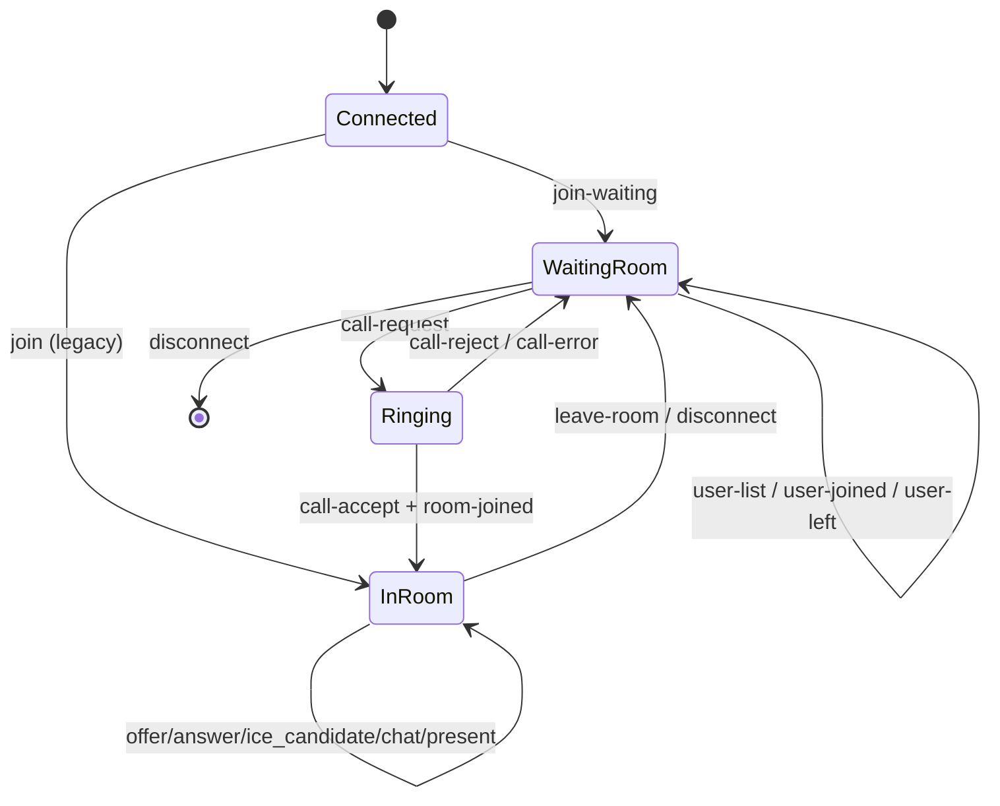

# WebSocket 접속 단계별 프로토콜 흐름

이 문서는 `webrtc/v01/ws` 엔드포인트 기준으로, 클라이언트가 접속한 뒤 어떤 메시지를 어떤 순서로 주고받아야 하는지 단계별로 설명합니다.  
기준 코드: `controller/signaling.go`

---

## 0) 한눈에 보는 흐름

1. WebSocket 연결 (`GET /webrtc/v01/ws`)
2. 첫 메시지 전송 (필수): `join-waiting` 또는 `join`
3. 대기실 동기화: `user-list`, `user-joined`, `user-left`
4. 통화 요청/응답: `call-request`, `call-response`
5. 방 입장: `room-joined` (+ `start`, text 모드 제외)
6. 방 내 시그널링: `offer`, `answer`, `ice_candidate`, `chat`, `present`
7. 종료/이탈: `leave-room` 또는 소켓 종료 -> 대기실 복귀

---

## 1) 연결 단계 (Handshake)

### 1-1. 연결
- 클라이언트가 `ws://<host>:<port>/webrtc/v01/ws` 로 연결합니다.
- 서버는 최대 연결 수(`MAX_VDWS_CONNECT`)를 넘으면 연결을 거절합니다.

### 1-2. 첫 메시지 규칙 (중요)
- 연결 직후 **10초 이내** 첫 메시지를 보내야 합니다.
- 첫 메시지 타입은 아래 둘 중 하나만 허용됩니다.
  - `join-waiting` (신규 대기실 플로우)
  - `join` (레거시 직접 방 입장 플로우)
- 다른 타입을 보내면 서버가 연결을 종료합니다.

### 1-3. 권장 첫 메시지 (대기실)
```json
{
  "type": "join-waiting",
  "data": {
    "name": "alice",
    "user_id": "1001"
  }
}
```

`user_id`는 필수입니다. 없으면 서버가 연결을 끊습니다.

---

## 2) 대기실 프로토콜

### 2-1. 서버 -> 본인: 사용자 목록
`join-waiting` 성공 직후 서버는 본인에게 현재 대기 사용자 목록을 보냅니다.

```json
{
  "type": "user-list",
  "data": {
    "users": [
      { "user_id": "1002", "name": "bob" },
      { "user_id": "1003", "name": "charlie" }
    ]
  }
}
```

### 2-2. 서버 -> 다른 사용자들: 입장 알림
새 사용자가 들어오면 다른 대기 사용자에게 `user-joined`를 브로드캐스트합니다.

```json
{
  "type": "user-joined",
  "data": {
    "user_id": "1001",
    "name": "alice"
  }
}
```

### 2-3. 서버 -> 대기실: 퇴장 알림
대기실 상태에서 연결이 끊기면 `user-left`가 전파됩니다.

```json
{
  "type": "user-left",
  "data": {
    "user_id": "1001"
  }
}
```

---

## 3) 통화 요청/응답 프로토콜

### 3-1. 클라이언트 -> 서버: `call-request`
```json
{
  "type": "call-request",
  "data": {
    "from": "1001",
    "to": "1002",
    "room_id": "1001_1002",
    "mode": "audio"
  }
}
```

`mode`는 `video` / `audio` / `text` 를 사용합니다.

### 3-2. 서버 -> 대상자: `call-request`
서버가 대상자를 찾으면 대상 소켓으로 그대로 전달합니다.

### 3-3. 대상자 -> 서버: `call-response`
```json
{
  "type": "call-response",
  "data": {
    "from": "1002",
    "to": "1001",
    "room_id": "1001_1002",
    "accept": true,
    "mode": "audio"
  }
}
```

### 3-4. 서버 -> 요청자: `call-accept` 또는 `call-reject`
- `accept=true`면 `call-accept`
- `accept=false`면 `call-reject`

대상자가 대기실에 없으면 요청자에게 `call-error`를 보냅니다.

---

## 4) 방 이동 프로토콜

`call-accept` 이후 서버는 두 사용자를 대기실에서 제거하고 방으로 이동시킵니다.

### 4-1. 서버 -> 양쪽: `room-joined`
```json
{
  "type": "room-joined",
  "data": {
    "room_id": "1001_1002"
  }
}
```

### 4-2. 서버 -> 양쪽: `start` (text 제외)
- `mode != "text"` 일 때만 전송됩니다.
- `video`/`audio` 모드에서 WebRTC 협상 시작 신호로 사용합니다.

---

## 5) 방 내부 메시지 프로토콜

방에 들어간 뒤에는 아래 타입을 사용합니다.

- `offer`
- `answer`
- `ice_candidate`
- `chat`
- `present`
- `leave-room` (방 나가기)

### 5-1. WebRTC 시그널링
- `offer` / `answer` / `ice_candidate` 는 상대방에게 중계됩니다.
- 메시지 payload는 클라이언트 구현체(WebRTC SDK) 형식에 맞추면 됩니다.

### 5-2. 부가 메시지
- `chat`: 방 내 텍스트 채팅
- `present`: 선물 이벤트

---

## 6) 종료/이탈 프로토콜

### 6-1. 클라이언트가 `leave-room` 전송
- 서버는 해당 사용자를 대기실로 복귀시킵니다.
- 본인에게 `returned-to-waiting`를 보냅니다.
- 상대방에게 `partner-left`를 보낸 뒤 대기실로 복귀시킵니다.

### 6-2. 소켓 비정상 종료
- 읽기 루프 종료 시 동일하게 정리 로직이 수행됩니다.
- 서버는 방/대기실 상태를 정리하고 필요 알림을 전송합니다.

---

## 7) 권장 클라이언트 구현 체크리스트

- 연결 직후 10초 안에 `join-waiting` 전송
- `user_id`는 빈 값 금지
- `call-request`의 `from`, `to`, `room_id`, `mode` 필수 채움
- `call-response`의 `accept`를 명시적으로 전송
- `room-joined` 수신 후 WebRTC 협상 준비
- `start` 수신 후 `offer` 생성 시작 (`audio`/`video` 모드)
- 종료 시 `leave-room` 또는 소켓 종료 처리

---

## 8) 상태 전이 다이어그램 (간단)



---

## 9) 실무 팁

- 메시지 `type` 문자열은 서버 switch와 정확히 일치해야 합니다.
  - 예: `ice_candidate` (언더스코어), `ice-candidate` 아님
- 프로토콜은 **대기실 기반(`join-waiting`)**을 기본으로 사용하는 것이 안정적입니다.
- 재접속 시 같은 `user_id`로 접속하면 기존 연결이 정리될 수 있으므로, 클라이언트에서 단일 세션 정책을 명확히 두는 것을 권장합니다.
